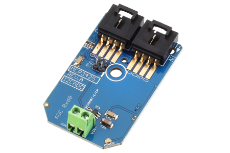

[](https://www.controleverything.com/content/Analog-Digital-Converters?sku=MCP3425_I2CADC)
# MCP3425
MCP3425 Analog to Digital Converter

The MCP3425 is a 1-Channel Analog to Digital Converter.

This Device is available from ControlEverything.com [SKU: MCP3425_I2CADC]

https://www.controleverything.com/content/Analog-Digital-Converters?sku=MCP3425_I2CADC

This Sample code can be used with Raspberry Pi, Arduino, Particle Photon, Beaglebone Black and Onion Omega.

## Java
Download and install pi4j library on Raspberry pi. Steps to install pi4j are provided at:

http://pi4j.com/install.html

Download (or git pull) the code in pi.

Compile the java program.
```cpp
$> pi4j MCP3425.java
```

Run the java program.
```cpp
$> pi4j MCP3425
```

## Python
Download and install smbus library on Raspberry pi. Steps to install smbus are provided at:

https://pypi.python.org/pypi/smbus-cffi/0.5.1

Download (or git pull) the code in pi. Run the program.

```cpp
$> python MCP3425.py
```

## Arduino
Download and install Arduino Software (IDE) on your machine. Steps to install Arduino are provided at:

https://www.arduino.cc/en/Main/Software

Download (or git pull) the code and double click the file to run the program.

Compile and upload the code on Arduino IDE and see the output on Serial Monitor.


## Particle Photon

Login to your Photon and setup your device according to steps provided at:

https://docs.particle.io/guide/getting-started/connect/photon/

Download (or git pull) the code. Go to online IDE and copy the code.

https://build.particle.io/build/

Verify and flash the code on your Photon. Code output is shown in logs at dashboard:

https://dashboard.particle.io/user/logs


##C

Setup your BeagleBone Black according to steps provided at:

https://beagleboard.org/getting-started

Download (or git pull) the code in Beaglebone Black.

Compile the c program.
```cpp
$>gcc MCP3425.c -o MCP3425
```
Run the c program.
```cpp
$>./MCP3425
```

## Onion Omega

Get Started and setting up the Onion Omega according to steps provided at :

https://wiki.onion.io/Get-Started

To install the Python module, run the following commands:
```cpp
opkg update
```
```cpp
opkg install python-light pyOnionI2C
```

Download (or git pull) the code in Onion Omega. Run the program.

```cpp
$> python MCP3425.py
```

## ESP8266
 
Install the Boards Manager on your Arduino IDE. The Steps are provided at:
 
http://www.arduinesp.com/getting-started
 
Download (or git pull) the code and double click the file to run the program.
 
Compile and upload the code on Arduino IDE and see the output on Serial Monitor.
 
Copy the IP Address of your ESP8266 from Serial Monitor and paste it in your Web Browser to see the result on Web Server.
 
Note: Your system and ESP8266 should be connected to same Wi-Fi Network.

#####The code output is digital value of an analog input.
